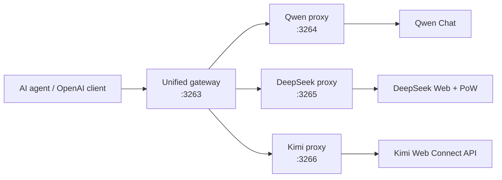

<div align="center">

# FreeKimiQwenDeepseekApi

**Turn Qwen Chat, DeepSeek Web, and Kimi Web into local OpenAI-compatible APIs for agents, apps, and experiments.**

[](https://github.com/kravchenski/FreeKimiQwenDeepseekApi/actions/workflows/ci.yml)
[](https://github.com/kravchenski/FreeKimiQwenDeepseekApi/actions/workflows/release.yml)
[](https://github.com/kravchenski/FreeKimiQwenDeepseekApi/stargazers)
[](https://bun.sh)
[](#api-reference)
[](LICENSE)

[Quick start](#quick-start) · [Providers](#provider-map) · [Docker](#docker) · [Agents](#ai-agent-setup) · [API](#api-reference) · [Security](#security) · [Docs](#documentation)

</div>

FreeKimiQwenDeepseekApi is an unofficial, browser-backed proxy for
[Qwen Chat](https://chat.qwen.ai/), [DeepSeek Web](https://chat.deepseek.com/),
and [Kimi Web](https://www.kimi.com/).
It preserves authenticated browser sessions and exposes local APIs compatible
with OpenAI Chat Completions.

Use it to connect Qwen Chat, DeepSeek Web, and Kimi Web to **Pi Agent**, OpenCode,
Continue, Hermes Agent, Aider, Cline, Codex, Claude Code, Open WebUI, OpenAI
SDKs, and other compatible clients.

> [!IMPORTANT]
> This project is not an official Alibaba Cloud, Qwen, DeepSeek, or Moonshot AI API, and it
> does not run models locally. Provider web APIs, rate limits, and account
> behavior can change at any time. Use official provider APIs for production.

## Highlights

- **OpenAI-compatible chat** with regular and streaming responses.
- **Agent tool calls** through an OpenAI-compatible adapter for pi agent and Hermes.
- **Multimodal input**, file upload, image generation, and video generation.
- **Multi-account rotation** with rate-limit and invalid-session tracking.
- **Conversation continuity** with chat IDs, parent IDs, and scoped sessions.
- **Current Qwen model discovery** from Qwen Chat metadata.
- **DeepSeek Web support** with PoW solving, reasoning mode, and persistent sessions.
- **Kimi Web support** with reasoning, web search, and persistent sessions.
- **Bun-first runtime** with a reproducible `bun.lock`.
- **Docker image** based on Bun and system Chromium.
- **CI/CD** for tests, Bun build validation, Docker builds, and GHCR releases.

## Provider Map

Run one provider directly, or connect clients to the unified gateway and switch
models without changing the base URL.

| Service | Local endpoint | Container image | Example model |
| --- | --- | --- | --- |
| Unified gateway | `http://127.0.0.1:3263/api` | `ghcr.io/kravchenski/freekimiqwendeepseekapi/gateway` | Routes all models |
| Qwen Chat | `http://127.0.0.1:3264/api` | `ghcr.io/kravchenski/freekimiqwendeepseekapi/qwen` | `qwen3-coder-plus` |
| DeepSeek Web | `http://127.0.0.1:3265/api` | `ghcr.io/kravchenski/freekimiqwendeepseekapi/deepseek` | `deepseek-reasoner` |
| Kimi Web | `http://127.0.0.1:3266/api` | `ghcr.io/kravchenski/freekimiqwendeepseekapi/kimi` | `kimi-k2.6-thinking` |

## How It Works



The proxy keeps authentication data locally under `session/`. Requests are mapped
to the selected provider and translated back into OpenAI-compatible responses.

## Quick Start

Choose the path that matches how you want to use the project:

| Goal | Start command | Client base URL |
| --- | --- | --- |
| Try Qwen locally | `bun run start:full` | `http://127.0.0.1:3264/api` |
| Run DeepSeek only | `bun run start:deepseek:full` | `http://127.0.0.1:3265/api` |
| Run Kimi only | `bun run start:kimi:full` | `http://127.0.0.1:3266/api` |
| Run every provider with Docker after authentication | `docker compose up --build -d` | `http://127.0.0.1:3263/api` |

### Requirements

- [Bun](https://bun.sh/) 1.2 or newer
- Chrome, Chromium, Edge, or Brave
- A Qwen Chat account

Native startup is tested on Linux, macOS, and Windows. Docker runs through a
Linux container runtime such as Docker Desktop. See
[`docs/PLATFORM_SUPPORT.md`](docs/PLATFORM_SUPPORT.md).

### Install and authenticate

```bash
git clone https://github.com/kravchenski/FreeKimiQwenDeepseekApi.git
cd FreeKimiQwenDeepseekApi

bun run start:full
```

The cross-platform launcher installs dependencies, runs offline checks, opens the
authentication flow when no active account exists, synchronizes models, and
starts the proxy. Sign in to Qwen Chat and return to the terminal when prompted.

Compatibility wrappers are also available: `./start.sh` on Linux/macOS and
`start.bat` on Windows.

To run each step manually:

```bash
bun install
bun run auth
bun run models:sync
SKIP_ACCOUNT_MENU=true bun start
```

The API is now available at:

```text
http://127.0.0.1:3264/api
```

Verify the installation from another terminal:

```bash
curl http://127.0.0.1:3264/api/health
bun run smoke
```

## First Request

```bash
curl http://127.0.0.1:3264/api/chat/completions \
  -H "Content-Type: application/json" \
  -d '{
    "model": "qwen3.7-max",
    "messages": [
      {
        "role": "user",
        "content": "Explain what FreeKimiQwenDeepseekApi does in one sentence."
      }
    ],
    "stream": false
  }'
```

### OpenAI SDK with TypeScript

```ts
import OpenAI from "openai";

const qwen = new OpenAI({
  baseURL: "http://127.0.0.1:3264/api",
  apiKey: "dummy-key",
});

const response = await qwen.chat.completions.create({
  model: "qwen3.7-max",
  messages: [{ role: "user", content: "Hello from the OpenAI SDK." }],
});

console.log(response.choices[0].message.content);
```

### Streaming

```ts
const stream = await qwen.chat.completions.create({
  model: "qwen3.7-plus",
  messages: [{ role: "user", content: "Write a short Bun example." }],
  stream: true,
});

for await (const chunk of stream) {
  process.stdout.write(chunk.choices[0]?.delta?.content ?? "");
}
```

More examples are available in [`examples/`](examples/README.md).

## DeepSeek Web

DeepSeek runs as a separate proxy because its web API uses different sessions,
payloads, SSE events, and a Proof-of-Work challenge.

```bash
bun run start:deepseek:full
```

The startup menu matches the Qwen flow:

```text
1 - Register or add a new account
2 - Relogin an account
3 - Start the proxy
4 - Remove an account
```

Registration opens a normal system Chromium with a persistent profile under
`session/deepseek/browser-profile`. Complete registration or sign in, wait for
the DeepSeek chat interface, return to the terminal, and press Enter. The proxy
captures the authenticated request token and verifies the `ds_session_id`
cookie before saving the account.

Manage accounts directly:

```bash
bun run auth:deepseek -- --list
bun run auth:deepseek -- --add
bun run auth:deepseek -- --relogin
bun run auth:deepseek -- --remove
```

The DeepSeek API is available at:

```text
http://127.0.0.1:3265/api
```

Test it:

```bash
curl http://127.0.0.1:3265/api/chat/completions \
  -H "Content-Type: application/json" \
  -d '{
    "model": "deepseek-default",
    "messages": [{"role": "user", "content": "Hello"}],
    "stream": false
  }'
```

DeepSeek presets:

| Model | Mode |
| --- | --- |
| `deepseek-default` | General chat and coding |
| `deepseek-reasoner` | Thinking/reasoning |
| `deepseek-expert` | Expert model route |
| `deepseek-search` | Web-search-enabled route |

## Kimi Web

Kimi runs as a separate browser-authenticated proxy using the current Kimi Web
Connect/JSON protocol.

```bash
bun run start:kimi:full
```

Manage accounts directly:

```bash
bun run auth:kimi -- --list
bun run auth:kimi -- --add
bun run auth:kimi -- --relogin
bun run auth:kimi -- --remove
```

The Kimi API is available at `http://127.0.0.1:3266/api`. Available presets are
`kimi-k2.6`, `kimi-k2.6-thinking`, `kimi-k2.6-search`, and
`kimi-k2.6-thinking-search`.

## AI Agent Setup

Configure the supported agents with one safe, cross-platform command:

```bash
bun run setup:agents -- --dry-run
bun run setup:agents
```

The installer merges Pi Agent, OpenCode, Continue, and Hermes configurations,
creates standalone Aider and Cline settings, and generates LiteLLM bridge
profiles for Codex and Claude Code. Existing files receive a
`.freeqwenapi.bak` backup before the first change.

```bash
bun run setup:agents -- --agent pi,opencode,hermes
bun run setup:agents -- --help
```

See [`docs/AGENT_INTEGRATIONS.md`](docs/AGENT_INTEGRATIONS.md) for the support
matrix, generated paths, and launch commands.

### Pi Agent

FreeKimiQwenDeepseekApi exposes Qwen, DeepSeek, and Kimi through one `freeai` provider. Pi can
switch between all available models with `/model` while keeping its local
session and each provider's native remote chat stable.

```bash
bun run setup:pi
docker compose up -d
pi --provider freeai --model qwen3-coder-plus
```

`bun run setup:pi` synchronizes all Qwen, DeepSeek, and Kimi models into
`~/.pi/agent/models.json`. The unified endpoint is
`http://127.0.0.1:3263/api`. See
[`examples/pi-agent/README.md`](examples/pi-agent/README.md) for details.

## Open WebUI

Add an OpenAI-compatible connection:

| Setting | Value |
| --- | --- |
| Base URL | `http://127.0.0.1:3264/api` |
| API key | `dummy-key` or your configured proxy key |
| Model | `qwen3.7-max` |

When Open WebUI runs in Docker, use `http://host.docker.internal:3264/api`.

See [`docs/OPENWEBUI_SETUP.md`](docs/OPENWEBUI_SETUP.md) for the complete setup.

## Other Integrations

### Hermes Agent

```yaml
custom_providers:
  - name: freeai
    base_url: http://127.0.0.1:3263/api
    api_key: dummy-key
    models:
      qwen3-coder-plus:
        context_length: 131072
      deepseek-default:
        context_length: 131072
```

### LiteLLM

```yaml
model_list:
  - model_name: qwen3-coder-plus
    litellm_params:
      model: openai/qwen3-coder-plus
      api_base: http://127.0.0.1:3263/api
      api_key: dummy-key
```

Ready-made configurations:

- [`examples/hermes/config-snippet.yaml`](examples/hermes/config-snippet.yaml)
- [`examples/litellm/freeai_litellm.yaml`](examples/litellm/freeai_litellm.yaml)

## Models

The default model list is stored in [`src/AvailableModels.txt`](src/AvailableModels.txt).
Refresh it from Qwen Chat metadata with:

```bash
bun run models:sync
```

Common choices:

| Use case | Model |
| --- | --- |
| General chat and agents | `qwen3.7-max` |
| Fast general chat | `qwen3.7-plus` |
| Coding | `qwen3-coder-plus` |
| Vision, image, and video workflows | `qwen3-vl-plus` |

Inspect the models exposed by your running proxy:

```bash
curl http://127.0.0.1:3264/api/models
```

## Image Generation

By default, image requests use Qwen Chat and do not require a DashScope API key:

```bash
curl http://127.0.0.1:3264/api/images/generations \
  -H "Content-Type: application/json" \
  -d '{
    "model": "qwen3-vl-plus",
    "prompt": "A cinematic robot walking through neon Warsaw",
    "size": "16:9"
  }'
```

Supported aspect ratios include `16:9`, `9:16`, `1:1`, and `4:3`. OpenAI-style
sizes such as `1024x1024` are converted automatically.

Set `"provider": "dashscope"` and configure `DASHSCOPE_API_KEY` to use the
legacy DashScope image provider.

## Video Generation

Wait for the result in the initial request:

```bash
curl http://127.0.0.1:3264/api/videos/generations \
  -H "Content-Type: application/json" \
  -d '{
    "model": "qwen3-vl-plus",
    "prompt": "A slow camera move through a futuristic city at night",
    "size": "16:9",
    "wait": true
  }'
```

For client-side polling, set `"wait": false` and query:

```bash
curl "http://127.0.0.1:3264/api/tasks/status/TASK_ID?wait=true"
```

See [`docs/IMAGE_GENERATION.md`](docs/IMAGE_GENERATION.md) for the
media-generation guide.

## API Reference

All routes are mounted under `/api`.

| Method | Endpoint | Description |
| --- | --- | --- |
| `GET` | `/health` | Lightweight service health |
| `GET` | `/status` | Browser authentication and account status |
| `GET` | `/models` | OpenAI-compatible model list |
| `POST` | `/chat` | Native simplified chat request |
| `POST` | `/chat/completions` | OpenAI-compatible Chat Completions |
| `POST` | `/v1/chat/completions` | Alternate OpenAI-compatible route |
| `POST` | `/chats` | Create a Qwen chat |
| `GET` | `/chats/:chatId/history` | Read locally stored chat history |
| `POST` | `/chats/:chatId/history` | Update locally stored chat history |
| `POST` | `/files/upload` | Upload an attachment |
| `POST` | `/files/getstsToken` | Request upload credentials |
| `POST` | `/images/generations` | Generate an image |
| `GET` | `/images/models` | List image models |
| `GET` | `/images/status` | Check image provider status |
| `POST` | `/videos/generations` | Generate a video |
| `GET` | `/videos/models` | List video models |
| `GET` | `/videos/status` | Check video provider status |
| `GET` | `/tasks/status/:taskId` | Poll an asynchronous media task |

### Tool Calls

`/chat/completions` accepts OpenAI-style `tools`, legacy `functions`, and tool
result messages. Qwen Chat does not expose native OpenAI tool schemas, so
FreeKimiQwenDeepseekApi translates tool definitions into a controlled prompt and converts
the model output back into `message.tool_calls`.

## Authentication and Accounts

Manage Qwen Chat accounts with:

```bash
bun run auth                 # interactive menu
bun run auth -- --add
bun run auth -- --list
bun run auth -- --relogin
bun run auth -- --remove
```

Multiple active accounts are selected in round-robin order. Rate-limited
accounts are temporarily skipped, while invalid accounts are marked for
reauthentication.

DeepSeek accounts are stored separately under `session/deepseek/` and managed
with `bun run auth:deepseek`. Multiple valid DeepSeek accounts are also selected
round-robin.

Kimi accounts are stored separately under `session/kimi/` and managed with
`bun run auth:kimi`. Multiple valid Kimi accounts are selected round-robin.

To protect the local proxy itself, add allowed bearer tokens to
`src/Authorization.txt`, one token per line. An empty or missing file disables
proxy-level authentication.

## Configuration

Create a local `.env` or export environment variables before starting the proxy.

| Variable | Default | Purpose |
| --- | --- | --- |
| `HOST` | `0.0.0.0` | HTTP bind address |
| `PORT` | `3264` | HTTP port |
| `DEEPSEEK_PORT` | `3265` | DeepSeek proxy HTTP port |
| `DEEPSEEK_BASE_URL` | `https://chat.deepseek.com` | DeepSeek Web origin |
| `DEEPSEEK_CHROME_PATH` | auto-detected | Interactive browser used for DeepSeek registration |
| `DEEPSEEK_BROWSER_PROFILE` | `session/deepseek/browser-profile` | Persistent DeepSeek browser profile |
| `DEEPSEEK_SESSION_DIR` | `session/deepseek` | Saved DeepSeek accounts and cookies |
| `DEEPSEEK_TOKEN` | unset | Optional non-interactive DeepSeek token fallback |
| `KIMI_PORT` | `3266` | Kimi proxy HTTP port |
| `KIMI_BASE_URL` | `https://www.kimi.com` | Kimi Web origin |
| `KIMI_CHROME_PATH` | auto-detected | Interactive browser used for Kimi registration |
| `KIMI_BROWSER_PROFILE` | `session/kimi/browser-profile` | Persistent Kimi browser profile |
| `KIMI_SESSION_DIR` | `session/kimi` | Saved Kimi accounts and remote chat mappings |
| `KIMI_TOKEN` | unset | Optional non-interactive Kimi access token fallback |
| `DEFAULT_MODEL` | `qwen-max-latest` | Default chat model |
| `SKIP_ACCOUNT_MENU` | `false` | Start without the interactive account menu |
| `NON_INTERACTIVE` | `false` | Alias for non-interactive startup |
| `CHROME_PATH` | auto-detected | Chromium or Chrome executable |
| `SESSION_DIR` | `session` | Local authentication storage |
| `LOG_LEVEL` | `info` | Winston log level |
| `PAGE_POOL_SIZE` | `3` | Maximum reusable browser pages |
| `MAX_FILE_SIZE` | `10485760` | Upload limit in bytes |
| `PAGE_TIMEOUT` | `120000` | Browser page timeout in milliseconds |
| `MAX_RETRY_COUNT` | `3` | Qwen request retry limit |
| `STREAMING_CHUNK_DELAY` | `20` | Streaming chunk delay in milliseconds |
| `ALLOW_UNSCOPED_SESSION_CHAT_RESTORE` | `false` | Enable legacy IP/User-Agent chat restore |
| `REQUEST_BODY_LIMIT` | `25mb` | Maximum JSON and URL-encoded request body |
| `RATE_LIMIT_WINDOW_MS` | `60000` | Per-client rate-limit window |
| `RATE_LIMIT_MAX_REQUESTS` | `120` | Maximum requests per window; `0` disables |
| `CORS_ALLOWED_ORIGINS` | unset | Comma-separated browser origins; use `*` explicitly for public CORS |
| `DASHSCOPE_API_KEY` | unset | Optional legacy image-generation provider |

Advanced endpoint, timeout, logging, and polling options are defined in
[`src/config.ts`](src/config.ts).

## Docker

Compose runs four isolated services. The gateway has no browser credentials and
only routes requests; every provider keeps its own process, health check, and
GHCR image.

| Compose service | Host port | Purpose |
| --- | --- | --- |
| `gateway` | `3263` | One OpenAI-compatible endpoint for every provider |
| `qwen-proxy` | `3264` | Qwen browser-backed proxy |
| `deepseek-proxy` | `3265` | DeepSeek Web proxy |
| `kimi-proxy` | `3266` | Kimi Web proxy |

### Start After Git Clone

Authentication must run on the host because production containers do not have
an interactive desktop browser:

```bash
git clone https://github.com/kravchenski/FreeKimiQwenDeepseekApi.git
cd FreeKimiQwenDeepseekApi

bun install --frozen-lockfile
bun run auth
bun run auth:deepseek -- --add
bun run auth:kimi -- --add

mkdir -p session logs uploads
docker compose up --build -d
docker compose ps
curl http://127.0.0.1:3263/ready
```

All providers must have a valid account before the unified gateway becomes
ready. Provider credentials stay under the ignored local `session/` directory.

The Compose configuration persists:

- `./session` for Qwen, DeepSeek, and Kimi authentication and remote chat mappings
- `./logs` for application logs
- `./uploads` for temporary uploads

The Docker image uses a multi-stage build:

- the builder installs only production Bun dependencies;
- the runtime contains only the application, production dependencies, and
  Debian `chromium-headless-shell`;
- tests, examples, documentation, build caches, and the full desktop Chromium
  package are excluded.

The verified local `linux/amd64` image is approximately `740 MB`, down from
approximately `1.03 GB`. Most remaining space belongs to Chromium and its
required browser runtime libraries. Exact sizes vary by architecture and
package updates.

Inspect the built images:

```bash
docker image ls freeqwenapi:latest deepseek-web-proxy:latest kimi-web-proxy:latest free-ai-gateway:latest
docker history freeqwenapi:latest
docker run --rm --entrypoint /usr/bin/chromium-headless-shell \
  freeqwenapi:latest --version
```

If the container exits with `Не найдено ни одного аккаунта`, run
`bun run auth` on the host and verify that `session/tokens.json` exists before
starting Compose.

### Published Image

GitHub Actions publishes a separate multi-architecture image for every service:

```bash
docker pull ghcr.io/kravchenski/freekimiqwendeepseekapi/qwen:latest
docker pull ghcr.io/kravchenski/freekimiqwendeepseekapi/deepseek:latest
docker pull ghcr.io/kravchenski/freekimiqwendeepseekapi/kimi:latest
docker pull ghcr.io/kravchenski/freekimiqwendeepseekapi/gateway:latest
```

The `latest` tag tracks the default branch. Every image is also published with
an immutable `sha-*` tag; version tags additionally publish semantic-version
tags.

Use the published images with the same Compose file:

```bash
export FREEAI_QWEN_IMAGE=ghcr.io/kravchenski/freekimiqwendeepseekapi/qwen:latest
export FREEAI_DEEPSEEK_IMAGE=ghcr.io/kravchenski/freekimiqwendeepseekapi/deepseek:latest
export FREEAI_KIMI_IMAGE=ghcr.io/kravchenski/freekimiqwendeepseekapi/kimi:latest
export FREEAI_GATEWAY_IMAGE=ghcr.io/kravchenski/freekimiqwendeepseekapi/gateway:latest
docker compose pull
docker compose up -d --no-build
```

Compose binds host ports to `127.0.0.1` by default. To require authentication
on the unified gateway, set a strong token before startup:

```bash
export GATEWAY_API_KEY="$(openssl rand -hex 32)"
docker compose up -d
```

### Add Codex

The installer creates the current Codex profile file
`~/.codex/freeai.config.toml` and preserves unrelated Codex settings:

```bash
bun run setup:agents -- --agent codex --api-key "${GATEWAY_API_KEY:-dummy-key}"
uvx --from "litellm[proxy]" litellm --config ~/.freeqwenapi/litellm.yaml --host 127.0.0.1 --port 4000
FREEAI_API_KEY="${GATEWAY_API_KEY:-dummy-key}" codex -p freeai
```

`bun run setup:agents -- --agent codex` also generates one Codex profile per
model, such as `freeai-qwen3-coder-plus`, `freeai-deepseek-reasoner`, and
`freeai-kimi-k2-6-thinking`. These profiles include manual context metadata so
Codex does not fall back to unknown-model defaults, and they inherit MCP servers
from your base `~/.codex/config.toml`.

## Development

```bash
bun install
bun run dev
```

Project checks:

```bash
bun run test
bun run analyze
bun run check
bun run ci
```

Useful commands:

| Command | Description |
| --- | --- |
| `bun start` | Start the proxy |
| `bun run start:full` | Install, validate, authenticate, sync models, and start |
| `bun run start:deepseek:full` | Install, validate, authenticate, and start DeepSeek |
| `bun run start:kimi:full` | Install, validate, authenticate, and start Kimi |
| `bun run dev` | Start with Bun watch mode |
| `bun run auth` | Manage Qwen accounts |
| `bun run start:deepseek` | Start the DeepSeek account menu and proxy |
| `bun run dev:deepseek` | Start the DeepSeek proxy with Bun watch mode |
| `bun run auth:deepseek` | Manage DeepSeek accounts |
| `bun run start:kimi` | Start the Kimi account menu and proxy |
| `bun run dev:kimi` | Start the Kimi proxy with Bun watch mode |
| `bun run auth:kimi` | Manage Kimi accounts |
| `bun run start:gateway` | Start the unified Qwen + DeepSeek + Kimi gateway |
| `bun run setup:agents` | Configure popular AI agents and bridge profiles |
| `bun run setup:pi` | Synchronize all models into Pi Agent |
| `bun run models:sync` | Refresh Qwen model metadata |
| `bun run smoke` | Test a running authenticated proxy |
| `bun run test` | Run offline Bun tests |
| `bun run analyze` | Detect unused files, exports, and dependencies |
| `bun run check` | Validate that the server bundles under Bun |
| `bun run ci` | Run all offline CI checks |

The smoke test is intentionally not part of CI because it requires a real Qwen
account and session.

The cross-platform launcher also supports:

```bash
bun run start:full -- --help
bun run start:full -- --check-only
bun run start:full -- --skip-checks --skip-sync
bun run start:full -- --auth
bun run start:full -- --service gateway
```

## Author

FreeKimiQwenDeepseekApi is developed and maintained by
[`kravchenski`](https://github.com/kravchenski).

## License

FreeKimiQwenDeepseekApi is released under the [MIT License](LICENSE).

Copyright (c) 2026 kravchenski.

## CI/CD

GitHub Actions workflows live in [`.github/workflows/`](.github/workflows/):

- **CI** runs analysis, tests, launcher validation, and Bun build validation on
  Linux, macOS, and Windows, plus a Linux Docker build.
- **Container release** publishes multi-platform images to GHCR for version tags
  such as `v1.2.3`, and can also be started manually.

Create a release image:

```bash
git tag v1.1.0
git push origin v1.1.0
```

## Security

Never commit or publish:

- `session/` or `session/tokens.json`
- `session/accounts/**/token.txt`
- `.env` files
- `Authorization.txt`
- cookies, browser profiles, or real bearer tokens

These paths are covered by [`.gitignore`](.gitignore), but always inspect staged
changes before pushing:

```bash
git diff --cached
```

If a token is exposed, revoke or refresh it immediately. Please report
security-sensitive issues privately instead of opening a public issue.
See [`SECURITY.md`](SECURITY.md) for the reporting policy.

## Troubleshooting

### No valid accounts found

Run `bun run auth -- --list`, then add or relogin an account.

### Chromium does not start

Chrome, Chromium, Edge, and Brave are discovered automatically on Linux,
macOS, and Windows. Set an executable explicitly if discovery fails:

```bash
CHROME_PATH=/usr/bin/chromium bun run auth
```

### Google rejects DeepSeek registration

DeepSeek registration uses a normal system browser and persistent profile,
instead of launching an automated Puppeteer browser. If Google still rejects
system Chromium, point the flow at an installed Google Chrome binary:

```bash
DEEPSEEK_CHROME_PATH=/path/to/google-chrome bun run auth:deepseek -- --add
```

### Pi cannot connect to DeepSeek

Keep the unified Compose stack running before starting Pi:

```bash
docker compose up -d
curl http://127.0.0.1:3263/api/models
pi --provider freeai --model deepseek-default
```

### The proxy starts but requests fail

Check:

```bash
curl http://127.0.0.1:3264/api/status
curl http://127.0.0.1:3264/api/models
```

Then inspect `logs/` and relogin if the Qwen session expired.

### A model is missing

Refresh metadata with `bun run models:sync`, or add the model to
`src/AvailableModels.txt`.

## Documentation

| Guide | What it covers |
| --- | --- |
| [`AI agent integrations`](docs/AGENT_INTEGRATIONS.md) | Pi, OpenCode, Continue, Hermes, Aider, Cline, Codex, and Claude Code |
| [`Platform support`](docs/PLATFORM_SUPPORT.md) | Linux, macOS, Windows, supported browsers, and Docker |
| [`Open WebUI setup`](docs/OPENWEBUI_SETUP.md) | Connect Open WebUI to the proxy |
| [`Image and video generation`](docs/IMAGE_GENERATION.md) | Media endpoints, models, and request formats |
| [`Qwen model synchronization`](docs/QWEN_CHAT_MODELS.md) | Refresh and maintain the Qwen model list |
| [`Examples`](examples/README.md) | TypeScript, Python, Hermes, LiteLLM, and Pi examples |
| [`Contributing`](CONTRIBUTING.md) | Development checks and pull-request requirements |
| [`Security policy`](SECURITY.md) | Private vulnerability reporting |

## Disclaimer

FreeKimiQwenDeepseekApi is an independent community project. It is not affiliated with,
endorsed by, or supported by Alibaba Cloud or the Qwen team. You are responsible
for complying with Qwen's terms, applicable laws, and the policies of any
connected service.

## Community

Updates and practical AI tooling from the fork maintainers:
[t.me/forgetmeai](https://t.me/forgetmeai).
